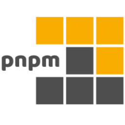

<a name="readme-top"></a>

<h1 align="center">Nuxt 3 - Starter Kit <br/>- work in progress, <a href="https://github.com/denissteinhorst/nuxt3-starter-kit/blob/main/TODO.md">current state</a> -</h1>

<div align="center">
  <br>
  <a>
    &nbsp;
    &nbsp;
    &nbsp;
    &nbsp;
    &nbsp;
    &nbsp;
    &nbsp;
  <br>  <br>
   &nbsp;
    &nbsp;
    &nbsp;
    &nbsp;
    &nbsp;
    &nbsp;
    &nbsp;
    &nbsp;
    &nbsp;
  </a>
  <br>
  <br>
  <p>- containing everything you'll ever need to jumpstart your next Project! -</p>
  <h1 align="center">&nbsp;</h1>
</div>

## About The Project

This Nuxt 3 Starter Kit is the plug and play solution for all your developer needs. We're talking: different Environments, Testing, Staging, Typing, Linting n'Everything already pre-configured. Heck, I even added full-fledged demo components! **Everything to bring you up to speed** 🚀

BUT: This Kit does not come with an UI Framework though, you can easily add one of your choice like:
[Bootstrap](https://getbootstrap.com/), [TailwindCSS](https://tailwindcss.com/), [Vuetify](https://vuetifyjs.com/en/), [Element Plus](https://element-plus.org/), [Quasar](https://quasar.dev/), [NaiveUI](https://www.naiveui.com/), [Bulma](https://bulma.io/), [Cherry](https://cherry.design) ...I'm sure you'll find something that fits your needs.

<p align="right">(<a href="#readme-top">back to top</a>)</p>

## Prerequisites

This Project requires the following to be installed:

- [Node.js](https://nodejs.org/en/) (build & tested with v18.15.0)
- [PNPM](https://pnpm.io/) (build & tested with v8.1.1)
- optional: [NVM](https://github.com/nvm-sh/nvm) (build & tested with v0.38.0)

  <p align="right">(<a href="#readme-top">back to top</a>)</p>

## Installation

<details>
<summary>Click here to expand the Installation Guide</summary>
<br>
<ul>
<li>
  <b>1) Install or Check correct node version </b>

```bash
nvm install --lts=Hydrogen 18.15.0
or nvm use 18.15.0 (if already installed)
```

```bash
nvm -v && node -v && npm -v
```

</li>
  <br>
<li>
  <b>2) Clone the Repository</b>

```bash
git clone https://github.com/denissteinhorst/nuxt3-starter-kit.git
```

</li>
  <br>
<li>
  <b>3) Switch into project Directory and install Dependencies</b>

```bash
cd nuxt3-starter-kit
pnpm install --shamefully-hoist
pnpm post install
```

</li>
</ul>
</details>
<p align="right">(<a href="#readme-top">back to top</a>)</p>

## Usage

<details>
<summary>Click here to expand the Usage Guide</summary>

<ul>
<br>
<li>
  <b>1) Since the ".env.*"-Files aren't part of the Repo, you need to create them </b>
 <br> <br>

_(assuming you are already in the project directory)_
<br><br>

for Mac/Linux Terminal:

```bash
for target in .env.development .env.staging .env.production; do cp .env $target; done
```

for Windows Powershell:

```PowerShell
foreach ($target in ".env.development", ".env.staging", ".env.production") {Copy-Item .env $target}
```

</li>
<br>
<li>
  <b>2) Change the Environment Variables for every Environment as needed</b>
  <br> <br>

| Variable    | Description            | Default             |
| ----------- | ---------------------- | ------------------- |
| `APP_ENV`   | Environment of the App | development         |
| `APP_DEBUG` | Debug Mode of the App  | true                |
| `APP_NAME`  | Name of the App        | Nuxt 3 Starter Kit  |
| `APP_HOST`  | URL of the App         | http://localhost/   |
| `APP_PORT`  | Port of the App        | 3000                |
| `NUXT_APP_BASE_URL` | Base URL of the App | /   |

</li>
<br>
<br>
<li>
  <b>3) Change the `.browserslistrc` Variables for target Audience if needed (currently using defaults)</b>
  <br> <br>
  
  See full list of options here: [Browserslist](https://github.com/browserslist/browserslist#full-list)
</li>
<br>
<li>
  <b>4) start with your desired run-mode</b>
<br> <br>

**Development:**
<br>
These are the commands you'll use during development.

| Command | Description | Port / Location |
| ------------------------- | -------------------------------------------------------------------- | ------------------ |
| `pnpm dev` | Starts the Nuxt-Development server with HMR (uses: .env.development) | :3000 |
| `pnpm lint` | Runs the ESLint-Runner for JS, TS-Files AND Prettier | - |
| `pnpm story` | Starts the Histoire-Store UI | :6006 |
| `pnpm test:ui` | Starts the Vitest-Test-Runner (Unit-Tests) | :51204/**vitest**/ |
| `pnpm test:e2e` | Starts the Playwrite-Test-Runner (e2e-Tests) | tbd |
| `pnpm cleanup` | removes common generated Nuxt files and caches, including: ".nuxt, .output, node_modules/.vite, node_modules/.cache" | - |

<br>

**Preview:**
<br>
The preview command starts a server to preview your Nuxt application after running the build command.

| Command | Description | Port / Location |
| ------------------------- | -------------------------------------------------------------------- | ------------------ |
| `pnpm preview:staging` | Starts the app in local preview (uses: .env.staging) | .output |
| `pnpm preview:production` | Starts the app in local preview (uses: .env.production) | .output |
| `pnpm story:preview` | Generates a static Histoire-UI | .output/storybook |
<br>

**Build:**
<br>
The build command creates a .output directory with all your application, server and dependencies ready for %stage%.

| Command | Description | Port / Location |
| ------------------------- | -------------------------------------------------------------------- | ------------------ |
| `pnpm build:staging` | Builds the app for staging (uses: .env.staging) | .output |
| `pnpm build:production` | Builds the app for production (uses: .env.production) | .output |
| `pnpm story:build` | Builds the app for production (uses: .env.production) | .output |

<br>

**Generate (static):**
<br>
The generate command pre-renders every route of your application and stores the result in plain HTML files that you can deploy on any static hosting services. The command triggers the nuxi build command with the prerender argument set to true

| Command | Description | Port / Location |
| ------------------------- | -------------------------------------------------------------------- | ------------------ |
| `pnpm generate:staging` | Builds a static app for staging (uses: .env.staging) | .output |
| `pnpm generate:production` |  Builds a static app for production (uses: .env.production) | .output |
<br>

**Misc:**
<br>
These are some additional commands you might find useful.

| Command | Description | Port / Location |
| ------------------------- | -------------------------------------------------------------------- | ------------------ |
| `pnpm lintfix` | Runs the ESLint-Runner with auto-fixing | - |
| `pnpm lint:js` | Runs the ESLint-Runner for JS, TS-Files | - |
| `pnpm lint:prettier` | Runs the ESLint-Runner for Prettier | - |
| `pnpm coverage` | Generates Vitest Coverage report | .coverage |
| `pnpm postinstall` | Runs all postinstall scripts | - |

...nuxt provides even more commands, like `info` or `analyze` you can find them in the <a href="https://nuxt.com/docs/api/commands/add">Nuxt CLI Docs</a>
</li>
<br>
</ul>
</details>
<p align="right">(<a href="#readme-top">back to top</a>)</p>

## How to Deploy

<details>
<summary>Click here to expand the Deployment Guide for: "Static Hosting Services"</summary>
<br>
<ul>
<li>
  <b>Deploy your Project to a: "Static Hosting Services"</b>

```bash
 pnpm build:production (or :staging)
```
You need to upload the .output folder to your hosting service and enjoy! (Beware that you need to set the correct base-url in your .env.production file as well as that writing to the filesystem is not possible on static hosting services without additional configuration.)


</li>
</ul>
</details>
<br>
<details>
<summary>Click here to expand the Deployment Guide for: "Node.JS Server" (Debian/Ubuntu)</summary>
<br>
<ul>
<li>
  <b>Deploy your Project to a: "Node.JS Server" (I used Debian 11)</b>
  
  <br>

1) Prerequisites
```bash
# connect to your server via ssh

ssh user@host

# update your system

sudo apt update && apt upgrade
```
[SOURCE: debian.org/doc/manuals/debian-faq](https://www.debian.org/doc/manuals/debian-faq/uptodate.de.html)

<br>

2) Install node.js
```bash
# install base nodejs

sudo apt install nodejs npm -y

# check if node is installed

node -v && npm -v
```
[SOURCE: phoenixnap.com/kb/debian-install-nodejs](https://phoenixnap.com/kb/debian-install-nodejs)

<br/>

3) Install NVM (Node Version Manager) and switch to the desired Node Version
```bash
# install nvm dependencies

sudo apt install curl gnupg2 -y

# install nvm

curl https://raw.githubusercontent.com/creationix/nvm/master/install.sh | bash

# add nvm to bashrc

source ~/.bashrc

# check if nvm is installed

nvm --version

# switch to --lts 18.15.0

nvm install --lts=Hydrogen 18.15.0

# check if node is installed

node -v && npm -v
```
[SOURCE: howtoforge.com/how-to-install-and-use-nvm-on-debian-11](https://www.howtoforge.com/how-to-install-and-use-nvm-on-debian-11/)

<br/>

4) Install PNPM
```bash
# install pnpm with node

node install -g pnpm

# check if pnpm is installed

pnpm --version
```
[SOURCE: pnpm.io/installation](https://pnpm.io/installation)

<br/>

5) install PM2
```bash
# install pm2

curl -sL https://raw.githubusercontent.com/Unitech/pm2/master/packager/setup.deb.sh | sudo -E bash -

# update to latest version

npm install pm2 -g && pm2 update

# enable autocompletion

pm2 completion install

# check if pm2 is installed

pm2 --version
```
[SOURCE: pm2.io/docs](https://pm2.io/docs/runtime/guide/installation/)

<br/>

6) Copy your Project to your Server

```bash
# if you want to use git (you have to build on your server!)

git clone https://github.com/denissteinhorst/nuxt3-starter-kit.git

cd nuxt3-starter-kit

pnpm install --shamefully-hoist

pnpm post install

pnpm build:production (or :staging)

# If you dont want to have the source code on your server 
# you can also just upload the .output folder

# on your local device

pnpm build:production (or :staging)
zip -r .output.zip .output

# connect to your server and create a new folder for your project

mkdir ~/nuxt3-starter-kit

# upload .output.zip to your server (e.g. via sftp)
# once uploaded, unzip the file with:

unzip .output.zip

# your directory should now look like this:

# /home/user/nuxt3-starter-kit/
#                             ├── .output
#                             └── .output.zip

# yes? nice! now remove the zip file

rm .output.zip

```

<br/>

7) Place launch script and pm2 config

```bash
# Assuming you're still in: /home/user/nuxt3-starter-kit/
# move pm2 config and launch script to your project folder

mv .output/public/pm2/* ~/nuxt3-starter-kit && rm -rf .output/public/pm2/

# your directory should now look like this:

# /home/user/nuxt3-starter-kit/
#                             ├── .output
#                             ├── ecosystem.config.js
#                             └── runapp.js

```

<br/>

8) Launch your App

```bash
# first: test if everything with node works as expected!

node runapp.js

# if you're now able to see your app in your browser:3000, you're good to go!
# finally: launch your app with pm2 and immediately start look at the logs

pm2 start ecosystem.config.js && pm2 monit

# if you read: nuxtapp > Listening http://[::]:3000 (after a few seconds)
# gratulation, your app is successfully running inside pm2!

# IF NOT: Check the troubleshooting section below for some common issues

# btw: Here are some useful pm2 commands:

pm2 list # list all running apps
pm2 start nuxtapp # start your app
pm2 stop nuxtapp # stop your app
pm2 delete nuxtapp # delete your app
pm2 show nuxtapp # show details about your app
pm2 monit # monitor your app (see runtime logs and more)
```

## AWESOME YOU MADE IT! 🎉

</li>
</ul>
</details>
<p align="right">(<a href="#readme-top">back to top</a>)</p>

## Troubleshooting

<details>
<summary>Click here to expand the Troubleshooting Guide</summary>
<br>
<ul>

### The App started fine via Node but I can't see my app in the browser
Check if your firewall is blocking the port you're using. If you're using ufw like i do, you can check if it's open with: 

```bash
sudo ufw status

# may you need to open the port with:

sudo ufw allow 3000/tcp
sudo ufw reload
```

### You started your app but you get an error like: "UnhandledPromiseRejectionWarning: SyntaxError: Unexpected token '?' at Loader.moduleStrategy (internal/modules/esm/translators.js:0:0)\"
Your PM2 (or node) runs probably a wrong node version, check if you're using the correct one with:
```bash
# starting with node

node -v

#starting with pm2

pm2 show nuxtapp

# Expected node.js version │ 18.15.0
```

### You started your app but you get an error like: [nitro] [dev] [uncaughtException] Error: listen EADDRINUSE: address already in use :::3000"
That means that your port is already in use. probably by another instance if your app:
```bash
# first check if pm2 runs your app

pm2 status

# if yes, stop it with:

pm2 stop nuxtapp

# if not, check if you have some node is running in the background (debian/ubuntu)

ps -aef | grep node

# you should see something like this:

USER       000000  123456  0 Apr11 ?        00:00:00 node /home/user/nuxtapp/runapp.js (THIS IS YOUR PORT BLOCKING INSTANCE)
USER       000000  123457  0 13:37 pts/0    00:00:00 grep node (THIS IS JUST YOUR SEARCH INSTANCE)

# kill the blocking instance with:
kill -9 ?????? (?????? is your instance id e.g. 123456)
```
</ul>
</details>
<p align="right">(<a href="#readme-top">back to top</a>)</p>

## Contributing

Contributions are what make the open source community such an amazing place to learn, inspire, and create. Any contributions you make are **greatly appreciated**.

If you have a suggestion that would make this better, please fork the repo and create a pull request. You can also simply open an issue with the tag "enhancement".
Don't forget to give the project a star! Thanks again!

  <p align="right">(<a href="#readme-top">back to top</a>)</p>

## Contact

Denis Steinhorst - contact@steinhor.st

Project Link: [https://github.com/denissteinhorst/nuxt3-starter](https://github.com/denissteinhorst/nuxt3-starter)

<p align="right">(<a href="#readme-top">back to top</a>)</p>

## Closing words

This Kit is in development. If you have any suggestions, feel free to open an issue or a pull request. I'm always happy to hear from you!

If you like the `Nuxt3-Starter-Kit`, please support me by granting a ⭐️ on the project.

  <p align="right">(<a href="#readme-top">back to top</a>)</p>

## Credits
  - Best-README-Template [from: othneildrew](https://github.com/othneildrew/Best-README-Template)
  - The free, open-source API [randomuser.me](https://randomuser.me)
  
  <p align="right">(<a href="#readme-top">back to top</a>)</p>

## Stack Documentation

|            | Website                                       | Description                                             | Documentation                                                         |
| ---------- | --------------------------------------------- | ------------------------------------------------------- | --------------------------------------------------------------------- |
| Nuxt 3     | [Nuxt 3](https://nuxt.com)                    | The Intuitive Web Framework                             | [Nuxt 3 Docs](https://nuxt.com/docs)                                  |
| Vue 3      | [Vue 3](https://vuejs.org)                    | Next Generation Frontend Tooling                        | [Vue 3 Docs](https://v3.vuejs.org/)                                   |
| Vite       | [Vite](https://vitejs.dev/)                   | The Progressive JavaScript Framework                    | [Vite Docs](https://vitejs.dev/guide/)                                |
| Pinia      | [Pinia](https://pinia.esm.dev/)               | The intuitive store for Vue.js                          | [Pinia Docs](https://pinia.esm.dev/)                                  |
| Histoire   | [Histoire](https://histoire.dev/)             | A new way to write stories                              | [Histoire Docs](https://histoire.dev/guide/vue3/getting-started.html) |
| Vitest     | [Vitest](https://vitest.dev/)                 | Blazing Fast Unit Test Framework                        | [Vitest Docs](https://vitest.dev/guide/)                              |
| Playwright | [Playwright](https://playwright.dev/)         | Reliable end-to-end testing                             | [Playwright Docs](https://playwright.dev/docs/intro)                  |
| PostCSS    | [PostCSS](https://postcss.org/)               | A tool for transforming CSS with JavaScript             | [PostCSS Docs](https://postcss.org/docs/)                             |
| ESLint     | [ESLint](https://eslint.org/)                 | Statically analyzes your code to quickly find problems  | [ESLint Docs](https://eslint.org/docs/user-guide/getting-started)     |
| Prettier   | [Prettier](https://prettier.io/)              | An opinionated code formatter                           | [Prettier Docs](https://prettier.io/docs/en/index.html)               |
| TypeScript | [TypeScript](https://www.typescriptlang.org/) | is JavaScript with syntax for types                     | [TypeScript Docs](https://www.typescriptlang.org/docs/)               |
| Sass       | [Sass](https://sass-lang.com/)                | CSS with superpowers                                    | [Sass Docs](https://sass-lang.com/documentation)                      |
| PNPM       | [PNPM](https://pnpm.io/)                      | Fast, disk space efficient package manager              | [PNPM Docs](https://pnpm.io/)                                         |
| VueMacros  | [VueMacros](https://vue-macros.sxzz.moe)      | Explore and extend more macros and syntax sugar to Vue. | [VueMacros Docs](https://vue-macros.sxzz.moe/guide/getting-started.html)                  |
| VueUse     | [VueUse](https://vueuse.org/)                 | Collection of essential Vue Composition API utilities   | [VueUse Docs](https://vueuse.org/guide/)                              |
| i18n       | [i18n](https://v8.i18n.nuxtjs.org)            | Internationalization plugin for Vue/Nuxt                | [i18n Docs](https://i18n.nuxtjs.org)                                  |
